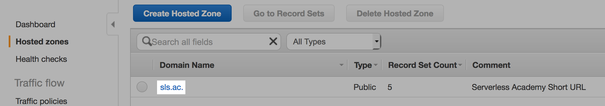
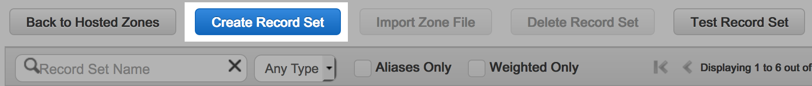
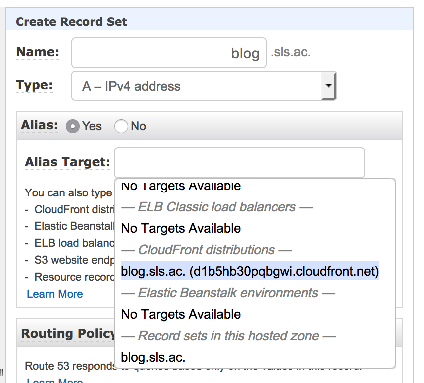

# Pointing to your blog's CloudFront distribution with Route 53

## Prerequisites

This guide assumes you already have a Hosted Zone set up for your domain. If you don't, and you need to add an already-purchased domain to Route 53, follow [this guide][addguide]. If you want to purchase a new domain through Amazon, follow [this guide][newguide].

You also should have deployed your site with `Site:URL` set in your [config.yaml file](../config.sample.yaml).

## Steps
1. Sign into AWS and open the [Route 53 Console](https://console.aws.amazon.com/route53/). Click "Hosted zones" in the sidebar.
2. If you met the prerequisites, you should see your domain name in the list. Click on it.
   
3. Click the blue "Create Record Set" button at the top of the page. A "Create Record Set" sidebar should appear
   
4. Enter the subdomain you want to use (if any) in the `Name` field. Leave the record type as `A`.
5. Click the "Yes" radio button next to `Alias`. Begin typing your domain in, and you should see your CloudFront distribution show up. Click on it.
   
6. Leave the rest of the values on their defaults and click "Create" at the bottom of the sidebar. Your blog should be available at the given domain once the DNS values propogate.

## Resources

- [Amazon talks about what `ALIAS` record sets are here][aliasguide]

[addguide]: https://docs.aws.amazon.com/Route53/latest/DeveloperGuide/creating-migrating.html "Configuring Amazon Route 53 as Your DNS Service"
[aliasguide]: https://docs.aws.amazon.com/Route53/latest/DeveloperGuide/resource-record-sets-choosing-alias-non-alias.html "Choosing Between Alias and Non-Alias Resource Record Sets"
[newguide]: https://docs.aws.amazon.com/Route53/latest/DeveloperGuide/domain-register.html "Registering a New Domain"
